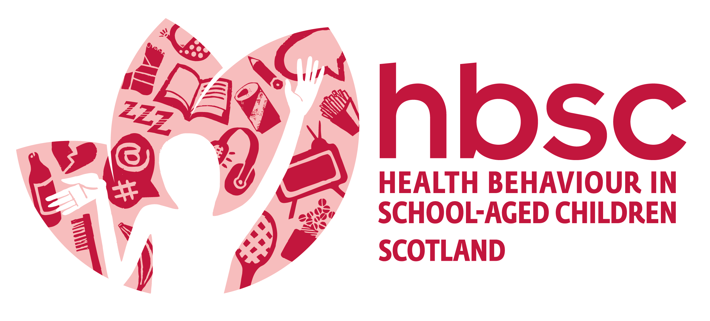
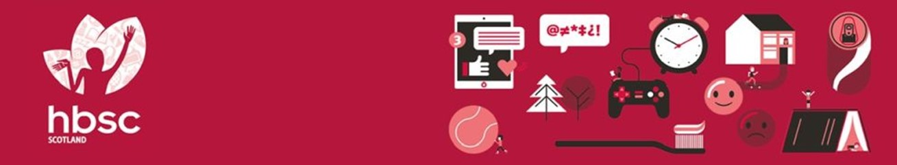
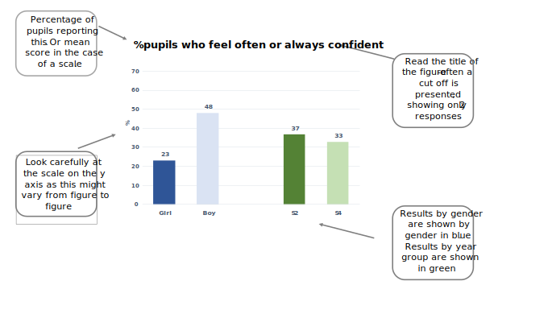

```{r setup, include=FALSE}
knitr::opts_chunk$set(echo = FALSE, message = FALSE, fig.width = 6.2, fig.height = 4.1)
library(readr)
library(scales)
library(flextable)
library(officer)
library(haven)
library(patchwork)
source("R/import and clean data.R")
source("R/functions.R")

primary_colour <-  "#2e3192"
secondary_colour <- "#016bb2"
main_colour <- "#333333"
global_girls_colour <- "#2F5597"
global_boys_colour <- "#DAE3F3"
global_s2_colour <- "#548235"
global_s4_colour <- "#C5E0B4"
global_good_colour <- "#8d96a3"
global_excel_colour <- "#00798c" 

scale_fill_hbsc <- \(x) scale_fill_manual(values = c(
  "Girls" = global_girls_colour,
  "Boys" = global_boys_colour,
  "S2" = global_s2_colour,
  "S4" = global_s4_colour
))

theme_set(theme_minimal() +
            theme(text = element_text(colour = main_colour, size = 18),
                  line = element_line(colour = main_colour),
                  axis.title = element_text(colour = secondary_colour,
                                            size = 18),
                  panel.grid.major.x = element_blank(),
                  # panel.grid.major.y = element_line(colour = "grey"),
                  axis.title.y = element_text(margin = margin(r = 15, unit = "pt")),
                  axis.title.x = element_blank(),
                  legend.position = "none",
                  strip.text = element_blank()
                  ))

update_geom_defaults("bar", list(fill = primary_colour))

school_dat <- hbsc2022[hbsc2022$school_id == params$school,] |>
  mutate(
    grade = if_else(Grade == "Secondary 2", "S2", "S4"),
    grade = factor(grade, levels = c("S2", "S4")),
    sex = factor(paste0(sex, "s"), levels = c("Girls", "Boys"))
  )

```

<!-- {width=20%} -->

<!-- {width=100%} -->

{width="8.728346456692913in" height="1.6220472440944882in"}

<!-- HEALTH BEHAVIOUR IN SCHOOL-AGED CHILDREN STUDY -->

> Scotland Pilot Study 2021

> Health and Wellbeing survey results for

> [`r params$school`]

{width="2.3958333333333335in" height="0.4125in"}{width="1.3854166666666667in" height="0.39861111111111114in"}

\newpage

###### Contents    
`r officer::block_toc(level = 2, style = NULL, separator = ";")`

###### Acknowledgements

This survey was conducted as part of the Health Behaviour in School-aged Children (HBSC) Scotland study, led by the MRC/CSO Social and Public Health Sciences Unit, University of Glasgow in collaboration with the School of Medicine, University of St Andrews. The HBSC study is funded by Public Health Scotland. The HBSC Scotland research team includes Dr Jo Inchley, Dorothy Currie, Dr Judith Brown, Judith Mabelis and Dr Malachi Willis. We would like to thank all the pupils who took part in the survey and the teachers who supported the pilot.

\newpage

# Introduction

#### The Health Behaviour in School-aged Children (HBSC) study

HBSC is a World Health Organisation (WHO) cross-national study which aims to increase our understanding of young people's health and wellbeing, health behaviours and the social context. HBSC monitors the health and health behaviour of young people over time and across countries as well as the wider context in which they live. This includes important aspects such as family and peer relationships, the school experience and the socio-economic environment in which they are growing up. This helps us to understand better what factors shape and influence health and health behaviours.

The first national HBSC study in Scotland was conducted in 1990 and it has been repeated every four years since then, providing a unique insight into how health and health behaviours have changed over the last 30+ years. HBSC involves 51 countries across Europe and North America and therefore allows us to see how young people in Scotland are doing compared with young people in other countries. The 2021/22 survey round has a special focus on mental health and wellbeing, and new questions to measure the impact of COVID-19 on children's wellbeing.

#### Pilot study

As part of our preparations for the 2022 survey, we piloted the survey questionnaire in 3 schools in November and December 2021. This report presents the survey data from your school, on the following health topics:

1.  General health and sleep
2.  Mental health and wellbeing
3.  Eating habits
4.  Physical activity and leisure activities
5.  Experience of bullying
6.  Substance use
7.  Electronic media use
8.  Impact of COVID 19
9.  Social relationships and support
10. The school environment

As well as the data, we have included notes and research evidence along with suggested resources to help promote pupil health and wellbeing. We hope you will find the report useful in reviewing the health and wellbeing of your pupils, and in identifying key targets for health improvement action planning in your school. The report is confidential, and only provided to the HBSC contact at your school. However, we would strongly encourage you to share the report more widely with your pupils, staff and parents.


### Understanding the data in this report

-   Generally, within the same figure, we provide results by gender (in blue) and also by year group (in green)

-   Most data are presented as a cut-off, for example, two answers to a question are combined, such as feeling 'often' or 'always' confident.

-   Some measures combine responses to a series of questions to create a mean score, for example, sleep quality, teacher support.

-   Some of the same measures were also used in the 2018 HBSC Scotland survey. To see the 2018 Scotland HBSC national report: [Media_707475_smxx.pdf (gla.ac.uk)](https://www.gla.ac.uk/media/Media_707475_smxx.pdf)

{width="7.138888888888889in" height="4.015526027996501in"}

### Your school's participation in the survey

Pupils in S2 and S4 classes in your school took part in the survey during November and December 2021. Table 1 shows the number of pupils participating by year group and gender. One pupil did not provide their year group and three pupils did not provide their gender.

Table 1: Overview of survey respondents

```{r tab.cap="economics table", tab.id = "mytab", tab.cap.style = "Table Caption"}
school_dat |> count(sex, AGECAT) |> 
  pivot_wider(names_from = AGECAT, values_from = n) |> 
  flextable()
```

And another table

|           | **S2** | **S4** |
|-----------|:-------|:-------|
| **Girls** | 10     | 13     |
| **Boys**  | 19     | 8      |

\newpage

# Your school’s survey results

## General Health and Sleep

This chapter reports data on general health and sleep. It includes the following measures:

-   Self-reported health

-   Health complaints

-   Sleep duration

-   Three dimensions of sleep quality (i) bedtime behaviours (ii) sleep efficiency (iii) better morning wakefulness

General health is closely related to mental health, with stress and poor mental wellbeing sometimes causing physical symptoms. The HBSC measure of self-reported health captures a global view of health. This is close to the World Health Organisation definition of health as a resource for living which goes beyond simply the absence of disease or the presence of wellbeing.^1^

Adolescents with poor self-rated health have been found to have more health complaints, lower life satisfaction, take part in less physical activity and find it harder to make friends.^2^ Subjective health is also related to wider aspects of young people's lives. For example, research in Norway found a close relationship between school-related stress and levels of support at school with headache, backache, abdominal pain and dizziness. ^3^

Sleep is a key contributor to adolescent wellbeing.^4^ Recent research has found that longer sleep duration is associated with better emotional regulation and a healthier body composition in children aged 0-17.^5-7^ In school-aged children, higher levels of sleep, in combination with high levels of physical activity, are associated with better cardiometabolic health.^6^ Longer sleep duration is also associated with better academic attainment and overall wellbeing.^7^

The quality of sleep is just as important as amount of sleep for improving wellbeing, since even managing to get the recommended hours of sleep each night will not refresh a child if the quality of the sleep is poor.^8,9^ The Scottish #Sleepyteens project found that sleep quality is poorer for those adolescents who use social media very intensively at night-time.^10^ Experts recommend that use of screens should be avoided in the hour before planned bedtime to avoid disruption to sleep. The Royal College of Paediatrics and Child Health have produced guides for parents to help them to negotiate the right amount of screen time for their children.^11^

\newpage

### Self-reported health

Pupils were asked to rate their own health. This figure the proportion of pupils reporting their health to be either 'excellent' or 'good'.

Figure 1: % pupils who report good or excellent health

```{r good_excel_health}

bar_by_cat(health, c("Good", "Excellent"))

```


### Multiple Health Complaints

Pupils were asked 'In the last 6 months how often have you had the following...?' and presented with a list of eight physical and psychological symptoms: headache, stomach-ache, backache, dizziness, feeling low, feeling nervous, feeling irritable and sleep difficulties. We looked at the proportion of young people who experienced this symptom, once a week or more and the results are shown for all pupils combined.

Figure 2: % pupils who report this type of health complaint once a week or more

[$$CHART$$]{.chart}

Figure 3 shows the percentage of pupils who report two or more health complaints, once a week or more.

Figure 3: % pupils who report two or more health complaints once a week or more

[$$CHART$$]{.chart}

### Sleep duration

Pupils were asked to estimate the time they usually go to bed and wake up on schooldays and on weekends/holidays. From this we calculated the number of hours of sleep. The figures show the mean number of hours slept on a school night and then on a weekend or holiday.

Current NHS recommendations are that children aged 12-17 years should aim for a minimum of 8-9 hours' sleep per night.

Figure 4: Mean number of hours pupils sleep on a school night

[$$CHART$$]{.chart}

Figure 5: Mean number of hours pupils sleep on weekends/holidays

[$$CHART$$]{.chart}

### Sleep quality

Pupils were asked ten questions about sleep quality, covering three different aspects: (i) bedtime behaviours, (ii) sleep efficiency and (iii) morning wakefulness. For each aspect of sleep, scores range from 1 to 6. A higher score indicates better sleep quality in that aspect.

Figure 6: Pupils' mean sleep quality scores, by gender

[$$CHART$$]{.chart}

Figure 7: Pupils' mean sleep quality scores, by year group

[$$CHART$$]{.chart}

### Who can help?

+-----------------------------------+-----------------------------------------------------------------------------------------------------------------------------------------------------------------------------------------------------------------------------------------------------------------------------+
| **Organisation**                  | **Description**                                                                                                                                                                                                                                                             |
+===================================+=============================================================================================================================================================================================================================================================================+
| Sleep Scotland                    | Sleep Scotland aims to provide the most appropriate intervention for families of children with sleep problems. They offer a range of resources including, a Sleep Support Line and a Sound Sleep programme-training day and teaching resource for professionals in schools. |
|                                   |                                                                                                                                                                                                                                                                             |
| <https://www.sleepscotland.org/>  |                                                                                                                                                                                                                                                                             |
|                                   |                                                                                                                                                                                                                                                                             |
| Sleep Support Line: 0800 138 6565 |                                                                                                                                                                                                                                                                             |
+-----------------------------------+-----------------------------------------------------------------------------------------------------------------------------------------------------------------------------------------------------------------------------------------------------------------------------+

## Mental Health and Wellbeing

This chapter presents data on mental health and wellbeing, and includes the following measures:

-   Life satisfaction

-   Feeling left out

-   Feeling confident

-   Happiness with life

-   Loneliness

-   WHO 5 Wellbeing Index -Low mood

-   Stress

-   Anxiety

-   Perception of bodyweight

Mental wellbeing is one of the Scottish Government's six public health priorities and is defined as: "...feeling good and functioning effectively, maintaining positive relationships and living a life that has a sense of purpose".^12^ Mental health and wellbeing is therefore more than the absence of mental illness but also about emotional wellbeing and functioning well in everyday life. It incorporates many components -- both positive and negative - such as stress, anxiety, self-confidence, self-esteem, social isolation, body image, life satisfaction and happiness. Together these factors can have an effect on academic and social development ^13^, leading to longer-term impacts on health, employment and social outcomes in adult life. ^14-16^

In recent years levels of mental wellbeing among young people have been declining in Scotland^17^ and there is international evidence to suggest that emotional disorders are increasing, particularly amongst adolescent girls. ^18,19^

An individual's mental health and wellbeing is influenced by a wide variety of factors including environmental, social and individual factors and the interaction between these. ^20^ Contextual factors may influence or be a consequence of mental health and also serve as a risk or protective factor. They operate at different levels: individual, family, learning environment, community and structural.^21^ Deprivation is a key risk factor for mental health; a systematic review showed that children and adolescents from socio-economically deprived backgrounds were two to three times more likely to develop mental health problems.^22^

In terms of promoting wellbeing, positive relationships with family, friends and school staff are consistently linked with health and wellbeing during adolescence.^23^ The school environment also plays a key role, with perceived academic ability, teacher support and school satisfaction linked to levels of life satisfaction and happiness.^24,25^ Research has also found that sleep and eating behaviours have stronger associations with adolescent wellbeing than bullying, physical activity and screen time.^26^

### Life satisfaction

Pupils were asked about their life satisfaction, using the 'Cantril Ladder'. This shows a ladder with rungs numbered from 0 ('worst possible life') to 10 ('best possible life'). Pupils were asked to mark where on the ladder they feel they stand at the moment. Here we show the proportion of pupils who report high life satisfaction (gave a rating of 6 or more out of 10).

**Figure 8: % pupils who report high life satisfaction (6 or more out of 10)**

[$$CHART$$]{.chart}

### Feeling left out

Pupils were asked "how often do you feel left out of things?". This figure shows the percentage of young people who say they 'often' or 'always' feel left out.

**Figure 9: % pupils who feel often or always left out**

[$$CHART$$]{.chart}

### Confidence

Pupils were asked 'how often do you feel confident in yourself?'. Here we show the proportion of pupils who responded that they 'often' or 'always' feel confident.

**Figure 10: % pupils who feel often or always confident**

[$$CHART$$]{.chart}

### Happiness

To gauge levels of happiness, pupils were asked "In general, how do you feel about your life at present?" Here we show those pupils that feel happy ('very' or 'quite') with their life.

**Figure 11: % pupils who feel happy with life**

[$$CHART$$]{.chart}

### Loneliness

Pupils were asked how often they had felt lonely in the past 12 months. Here we show the percentage of pupils who report feeling lonely 'most' or 'all of the time'.

**Figure 12: % pupils who feel lonely most or all of the time**

[$$CHART$$]{.chart}

### WHO 5 Wellbeing Index

The WHO--5 Wellbeing Index is a five-item scale which provides a measure of emotional functioning. Items are summed to create a score ranging from 0 to 100. A score of 50 or less indicates low mood.

**Figure 13: % pupils with low mood (WHO 5 Index)**

[$$CHART$$]{.chart}

### Stress

The Cohen Perceived Stress Scale asks four questions about how pupils feel they are coping with

problems and whether they feel in control of their life. The questions ask about experiences over the

last month, and scores range from 0 (no stress) to 16 (high stress).

**Figure 14: Pupils' mean stress score**

[$$CHART$$]{.chart}

### Anxiety

Pupils were asked to complete the Generalised Anxiety Disorder Scale. This asks seven questions about how often, over the past two weeks, pupils have been bothered by feelings such as feeling nervous, being unable to stop worrying, having trouble relaxing and feeling easily annoyed. The answers produce a score between 0 to 21. A score of 11 or more indicates moderate anxiety and a score of 17 or more indicates severe anxiety. Here we show the percentage of pupils who scored more than 11. Please note this should not be understood as a clinical diagnosis of anxiety.

**Figure 15: % of pupils reporting moderate or severe anxiety**

[$$CHART$$]{.chart}

### Perception of bodyweight

Pupils were asked whether they thought they were underweight, overweight or neither under- nor overweight. This figure shows the proportion of young people who felt they were about the right weight, that is neither over- nor underweight.

**Figure 16: % pupils who think they are neither over- nor underweight**

[$$CHART$$]{.chart}


### Who can help?

+---------------------------------------+-------------------------------------------------------------------------------------------------------------------------------------------------------------------------------------------------------------------------------------------------------------+
| **Organisation**                      | **Description**                                                                                                                                                                                                                                             |
+=======================================+=============================================================================================================================================================================================================================================================+
| MIND for better mental health         | MIND provides advice and support to empower anyone experiencing a mental health problem. They have information dedicated to                                                                                                                                 |
|                                       |                                                                                                                                                                                                                                                             |
| <https://www.mind.org.uk/>            | supporting children and young people.                                                                                                                                                                                                                       |
|                                       |                                                                                                                                                                                                                                                             |
| info rmation-support/for-childrenand- |                                                                                                                                                                                                                                                             |
|                                       |                                                                                                                                                                                                                                                             |
| young-people/                         |                                                                                                                                                                                                                                                             |
+---------------------------------------+-------------------------------------------------------------------------------------------------------------------------------------------------------------------------------------------------------------------------------------------------------------+
| Anna Freud National Centre for        | These resources, co-produced with young people, aim to provide information to young people on mental health and wellbeing to help                                                                                                                           |
|                                       |                                                                                                                                                                                                                                                             |
| Children and Families                 | make informed choices about their health.                                                                                                                                                                                                                   |
|                                       |                                                                                                                                                                                                                                                             |
| http s://www.annafreud.org/on-mymind/ |                                                                                                                                                                                                                                                             |
+---------------------------------------+-------------------------------------------------------------------------------------------------------------------------------------------------------------------------------------------------------------------------------------------------------------+
| Mental Health Foundation              | The Mental Health Foundation's mission is to raise awareness of mental health through education, community and support and thereby reduce the stigma associated with mental health. The website provides information on different mental health conditions. |
|                                       |                                                                                                                                                                                                                                                             |
| htt ps://mentalhealthfoundation.org/  |                                                                                                                                                                                                                                                             |
+---------------------------------------+-------------------------------------------------------------------------------------------------------------------------------------------------------------------------------------------------------------------------------------------------------------+
| Barnado's Scotland                    | Barnado's Scotland has put together a film for everyone involved in educating children and young people, highlighting the importance of                                                                                                                     |
|                                       |                                                                                                                                                                                                                                                             |
| http s://www.barnardos.org.uk/whatwe- | relationships in the school setting. It provides practical examples and tips that education staff can build into their everyday practice to                                                                                                                 |
|                                       |                                                                                                                                                                                                                                                             |
| do/supporting-young-people            | support positive relationships with young people.                                                                                                                                                                                                           |
+---------------------------------------+-------------------------------------------------------------------------------------------------------------------------------------------------------------------------------------------------------------------------------------------------------------+
| **Organisation**                      | **Description**                                                                                                                                                                                                                                             |
+---------------------------------------+-------------------------------------------------------------------------------------------------------------------------------------------------------------------------------------------------------------------------------------------------------------+
| See Me Scotland                       | See Me is passionate about ending mental health stigma and discrimination. The organisation works with individuals, groups, communities, workplaces, and education.                                                                                         |
|                                       |                                                                                                                                                                                                                                                             |
| <https://www.seemescotland.org/>      |                                                                                                                                                                                                                                                             |
+---------------------------------------+-------------------------------------------------------------------------------------------------------------------------------------------------------------------------------------------------------------------------------------------------------------+
| Samaritans Scotland                   | Samaritans supports schools, college communities and other youth                                                                                                                                                                                            |
|                                       |                                                                                                                                                                                                                                                             |
| htt ps://www.samaritans.org/scotland  | settings through our postvention services, lesson plans and school talks.                                                                                                                                                                                   |
|                                       |                                                                                                                                                                                                                                                             |
| /how-we-can-help/schools/             |                                                                                                                                                                                                                                                             |
+---------------------------------------+-------------------------------------------------------------------------------------------------------------------------------------------------------------------------------------------------------------------------------------------------------------+
| Breathing Space                       | Provides a free national phoneline service to address serious concerns about the mental wellbeing of people in Scotland.                                                                                                                                    |
|                                       |                                                                                                                                                                                                                                                             |
| <https://www.breathingspace.scot/>    |                                                                                                                                                                                                                                                             |
|                                       |                                                                                                                                                                                                                                                             |
| Call: 0800 838587                     |                                                                                                                                                                                                                                                             |
+---------------------------------------+-------------------------------------------------------------------------------------------------------------------------------------------------------------------------------------------------------------------------------------------------------------+
| Moodcafé                              | Resources for a range of mental health issues and learning disabilities developed for young people, adults and families by NHS Fife.                                                                                                                        |
|                                       |                                                                                                                                                                                                                                                             |
| <http://www.moodcafe.co.uk/>          |                                                                                                                                                                                                                                                             |
+---------------------------------------+-------------------------------------------------------------------------------------------------------------------------------------------------------------------------------------------------------------------------------------------------------------+
| Young Minds                           | Resources and information for young people experiencing Mental Health difficulties                                                                                                                                                                          |
|                                       |                                                                                                                                                                                                                                                             |
| <https://youngminds.org.uk/>          |                                                                                                                                                                                                                                                             |
+---------------------------------------+-------------------------------------------------------------------------------------------------------------------------------------------------------------------------------------------------------------------------------------------------------------+

# redundant code

## Eat fruit every day

Percentage who eat fruit every day

```{r fruits}

bar_by_gender(fruits, "Every day")

```

# Smoking in last 30 days

\% who have smoked in last 30 days

```{r smok30d_2}

bar_by_gender(smok30d_2)

```
