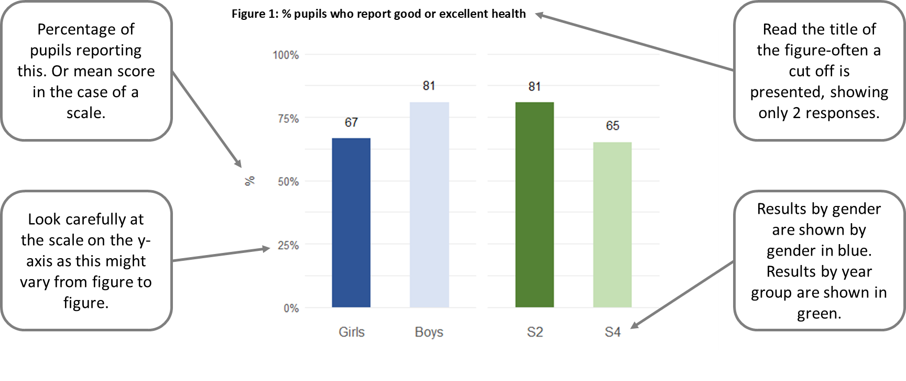

```{r setup, include=FALSE}
knitr::opts_chunk$set(
  echo = FALSE,
  message = FALSE,
  warning = FALSE,
  error = FALSE,
  eval = FALSE,
  fig.width = 6.2,
  fig.height = 4.1,
  fig.topcaption = TRUE,
  fig.cap.style = "Caption",
  tab.cap.style = "Caption",
  dpi = 300
)
library(readr)
library(tidyverse)
library(scales)
library(flextable)
library(officer)
library(haven)
library(patchwork)

primary_colour <-  "#2e3192"
secondary_colour <- "#016bb2"
main_colour <- "#333333"
global_girls_colour <- "#2F5597"
global_boys_colour <- "#DAE3F3"
global_s2_colour <- "#548235"
global_s4_colour <- "#C5E0B4"
global_good_colour <- "#8d96a3"
global_excel_colour <- "#00798c" 

source("R/import and clean data.R")
source("R/functions.R")


theme_set(theme_minimal() +
            theme(text = element_text(colour = "black"),
                  axis.text.y = element_text(size = 10),
                  axis.text.x = element_text(size = 12),
                  legend.text = element_text(size = 12),
                  legend.key.size = unit(0.4, "cm"),
                  line = element_line(colour = main_colour),
                  panel.grid.major.x = element_blank(),
                  panel.grid.minor.x = element_blank(),
                  # panel.grid.major.y = element_line(colour = "grey"),
                  axis.title.y = element_text(margin = margin(r = 10, unit = "pt")),
                  axis.title.x = element_blank(),
                  legend.position = "none",
                  strip.text = element_blank()
                  ))

update_geom_defaults("bar", list(fill = primary_colour))


```

```{r school_data, eval=TRUE, include=TRUE}

school_dat <- hbsc2022[hbsc2022$SCHOOL_number == params$school,] |>
  filter(school_level == "Secondary") |> 
  mutate(
    grade = if_else(Grade == "Secondary 2", "S2", "S4"),
    grade = factor(grade, levels = c("S2", "S4")),
    sex = factor(paste0(sex, "s"), levels = c("Girls", "Boys"))
  )

multi_grades <- "S2" %in% school_dat$grade & "S4" %in% school_dat$grade

missing_vals <- school_dat |> 
  summarise(missing_gender = sum(is.na(sex)),
            missing_grade = sum(is.na(grade)))

```


{width="6.7in"}

::: {custom-style="Title"}

HEALTH BEHAVIOUR IN SCHOOL-AGED CHILDREN STUDY

:::

::: {custom-style="Subtitle"}
Scotland Pilot Study 2021

Health and Wellbeing survey results for
:::

::: {custom-style="Schooltitle"}
[`r params$school`]
:::

::: {custom-style="Title"}

`r if(!params$censor) {"NON-CENSORED VERSION -- FOR DEVELOPMENT ONLY"}`

:::

`r ftext(" ", fp_text(color = "white", font.size = 40, bold = TRUE, font.family = "Bradley Hand"))`
`r fp_par(text.align = "center", padding.bottom = 200)`

::: {custom-style="nowrap"}


\newpage

:::

###### Contents    
`r officer::block_toc(level = 2, style = NULL, separator = ";")`

###### Acknowledgements

This survey was conducted as part of the Health Behaviour in School-aged Children (HBSC) Scotland study, led by the MRC/CSO Social and Public Health Sciences Unit, University of Glasgow in collaboration with the School of Medicine, University of St Andrews. The HBSC study is funded by Public Health Scotland. The HBSC Scotland research team includes Dr Jo Inchley, Dorothy Currie, Dr Judith Brown, Judith Mabelis and Dr Malachi Willis. Thank you to Dr Andy Baxter who worked with the HBSC Scotland team to generate the school reports.

We would like to thank all the pupils who took part in the survey, as well as the teachers for their support and assistance.

\newpage
# Introduction

#### The Health Behaviour in School-aged Children (HBSC) study

HBSC is a World Health Organisation (WHO) cross-national study which aims to increase our understanding of young people's health and wellbeing, health behaviours and the social context. HBSC monitors the health and health behaviour of young people over time and across countries as well as the wider context in which they live. This includes important aspects such as family and peer relationships, the school experience and the socio-economic environment in which they are growing up. This helps us to understand better what factors shape and influence health and health behaviours.

The first national HBSC study in Scotland was conducted in 1990 and it has been repeated every four years since then, providing a unique insight into how health and health behaviours have changed over the last 30+ years. HBSC involves 51 countries across Europe and North America and therefore allows us to see how young people in Scotland are doing compared with young people in other countries. The 2021/22 survey round has a special focus on mental health and wellbeing, and new questions to measure the impact of COVID-19 on children's wellbeing.

This report presents the survey data from your school, on the following health topics:

1.  General health and sleep
2.  Mental health and wellbeing
3.  Eating habits
4.  Physical activity and leisure activities
5.  Experience of bullying
6.  Substance use
7.  Electronic media use
8.  Impact of COVID 19
9.  Social relationships and support
10. The school environment

As well as the data, we have included notes and research evidence along with suggested resources to help promote pupil health and wellbeing. We hope you will find the report useful in reviewing the health and wellbeing of your pupils, and in identifying key targets for health improvement action planning in your school. The report is confidential, and only provided to the HBSC contact at your school. However, we would strongly encourage you to share the report more widely with your pupils, staff and parents.

\newpage
### Understanding the data in this report

-   Generally, within the same figure, we provide results by gender (in blue) and also by year group (in green)
-   Most data are presented as a cut-off, for example, two answers to a question are combined, such as feeling 'often' or 'always' confident.
-   Some measures combine responses to a series of questions to create a mean score, for example, sleep quality, teacher support.
-   Some of the same measures were also used in the 2018 HBSC Scotland survey. Please see the [2018 Scotland HBSC national report](https://www.gla.ac.uk/media/Media_707475_smxx.pdf) for more information about the survey.

{width="7.138888888888889in"}

### Your school's participation in the survey

::: {custom-style="FigDesc"}
Pupils in S2 and S4 classes in your school took part in the survey
during spring Term 2022. Table 1 shows the number of pupils
participating by year group and gender. `r if(missing_vals$missing_grade > 0) paste0(missing_vals$missing_grade, " pupil", ifelse(missing_vals$missing_grade > 1, "s", ""), " did not provide their year group. ")` `r if(missing_vals$missing_gender > 0) paste0(missing_vals$missing_gender, " pupil", ifelse(missing_vals$missing_gender > 1, "s", ""), " did not provide their gender.")`
:::

```{r tab_n_pupils, tab.cap="Overview of survey respondents", tab.id = "n_pupils", tab.cap.style = "Caption", eval = TRUE}
school_dat |>
  count(sex, grade) |> 
  filter(if_all(everything(), ~! is.na(.x))) |> 
  pivot_wider(names_from = grade, values_from = n) |> 
  rename(" " = sex) |> 
  rename_with(~paste0("&nbsp;&nbsp;&nbsp;&nbsp;", .x), .cols = -1) |> 
  knitr::kable()
```

\newpage

# Your school's survey results

## General Health and Sleep

This chapter reports data on general health and sleep. It includes the following measures:

-   Self-reported health
-   Health complaints
-   Sleep duration
-   Three dimensions of sleep quality (i) bedtime behaviours (ii) sleep efficiency (iii) better morning wakefulness

General health is closely related to mental health, with stress and poor mental wellbeing sometimes causing physical symptoms. The HBSC measure of self-reported health captures a global view of health. This is close to the World Health Organisation definition of health as a resource for living which goes beyond simply the absence of disease or the presence of wellbeing.^1^

Adolescents with poor self-rated health have been found to have more health complaints, lower life satisfaction, take part in less physical activity and find it harder to make friends.^2^ Subjective health is also related to wider aspects of young people's lives. For example, research in Norway found a close relationship between school-related stress and levels of support at school with headache, backache, abdominal pain and dizziness.^3^

Sleep is a key contributor to adolescent wellbeing. Recent research has found that longer sleep duration is associated with better emotional regulation and a healthier body composition in children aged 0-17.^4^ Longer sleep duration is also associated with better academic attainment and overall wellbeing.^5^

The quality of sleep is just as important as amount of sleep for improving wellbeing, since even managing to get the recommended hours of sleep each night will not refresh a child if the quality of the sleep is poor. The Scottish \#Sleepyteens project found that sleep quality is poorer for those adolescents who use social media very intensively at night-time.^6^ Experts recommend that use of screens should be avoided in the hour before planned bedtime to avoid disruption to sleep. The Royal College of Paediatrics and Child Health have produced guides for parents to help them to negotiate the right amount of screen time for their children.^7^

\newpage
### Self-reported health

::: {custom-style="FigDesc"}
Pupils were asked to rate their own health. This figure the proportion of pupils reporting their health to be either 'excellent' or 'good'.
:::

```{r good_excel_health, fig.cap="% pupils who report good or excellent health", fig.cap.style="Caption"}

school_dat |>
  bar_by_cat(health, c("Good", "Excellent"),
  .censor = params$censor)

```


### Multiple health complaints

::: {custom-style="FigDesc"}
Pupils were asked 'In the last 6 months how often have you had the following...?' and presented with a list of eight physical and psychological symptoms: headache, stomach-ache, backache, dizziness, feeling low, feeling nervous, feeling irritable and sleep difficulties. We looked at the proportion of young people who experienced this symptom, once a week or more.
:::

```{r mulciple_health, fig.cap="% pupils who report this type of health complaint once a week or more", fig.cap.style = "Caption"}
school_dat |> 
  bar_multiple_vars(
  list(
    headache =   "Headache",
    stomachache =   "Stomach-ache",
    backache =   "Backache",
    dizzy =   "Dizziness",
    feellow =   "Feeling low",
    nervous =   "Feeling nervous",
    irritable =   "Feeling irritable",
    sleepdificulty =   "Sleep difficulties"
  ),
  .censor = params$censor
)
```


::: {custom-style="FigDesc"}
The following figure shows the percentage of pupils who report two or more health complaints, once a week or more.
:::

```{r multi_health, fig.cap="% pupils who report two or more health complaints once a week or more", fig.id = "fig_multi_health"}

school_dat |>
  bar_by_cat(mhc_multi, "Yes", .censor = params$censor)

```

### Sleep duration

::: {custom-style="FigDesc"}
Pupils were asked to estimate the time they usually go to bed and wake up on schooldays and on weekends/holidays. From this we calculated the number of hours of sleep. The figures show the mean number of hours slept on a school night and then on a weekend or holiday.

Current NHS recommendations are that children aged 12-17 years should aim for a minimum of 8-9 hours' sleep per night.
:::

```{r sleep_dur, fig.cap="Mean number of hours pupils sleep on a school night"}
school_dat |>
  bar_mean_by_cat(Schooldays_sleep_hrs, .censor = params$censor, ylab = "Hours")
```

```{r weekend_sleep, fig.cap="Mean number of hours pupils sleep on weekends/holidays", fig.id="fig_weekend_sleep"}
school_dat |>
  bar_mean_by_cat(Weekend_sleep_hrs, .censor = params$censor, ylab = "Hours")
```


### Sleep quality

::: {custom-style="FigDesc"}
Pupils were asked ten questions about sleep quality, covering three different aspects: (i) bedtime behaviours, (ii) sleep efficiency and (iii) morning wakefulness. For each aspect of sleep, scores range from 1 to 6. A higher score indicates better sleep quality in that aspect.
:::

```{r mean_sleep_gender, fig.cap="Pupils' mean sleep quality scores, by gender"}
school_dat |>
  bar_mean_multiple_vars(
  list(
    SleepQual_GTB = "Bedtime behaviours",
    SleepQual_FARS = "Sleep efficiency",
    SleepQual_RTW = "Morning wakefulness"
  ),
  group = "sex",
  .censor = params$censor,
  ymax = 6,
  ylab = "Score"
)
```


```{r mean_sleep_grade, fig.cap="Pupils' mean sleep quality scores, by year group"}
school_dat |>
  bar_mean_multiple_vars(
  list(
    SleepQual_GTB = "Bedtime behaviours",
    SleepQual_FARS = "Sleep efficiency",
    SleepQual_RTW = "Morning wakefulness"
  ),
  group = "grade",
  .censor = params$censor,
  ymax = 6,
  ylab = "Score"
)
```

### Who can help?

+----------------------------------+----------------------------------+
| Organisation                     | Description                      |
+==================================+==================================+
| **Sleep Scotland**\              | Sleep Scotland aims to provide   |
| Support Line: 0800 138 6565\     | the most appropriate             |
| [Website][1]                     | intervention for families of     |
|                                  | children with sleep problems.    |
|                                  | They offer a range of resources  |
|                                  | including, a Sleep Support Line  |
|                                  | and a Sound Sleep                |
|                                  | programme-training day and       |
|                                  | teaching resource for            |
|                                  | professionals in schools.        |
+----------------------------------+----------------------------------+

<!-- *LINKS* -->
[1]: https://www.sleepscotland.org/

\newpage
## Mental Health and Wellbeing

This chapter presents data on mental health and wellbeing, and includes the following measures:

-   Life satisfaction
-   Feeling left out
-   Feeling confident
-   Happiness with life
-   Loneliness
-   WHO 5 Wellbeing Index -Low mood
-   Stress
-   Anxiety
-   Perception of bodyweight

Mental wellbeing is one of the Scottish Government's six public health priorities and is defined as: "...feeling good and functioning effectively, maintaining positive relationships and living a life that has a sense of purpose".^8^ Mental health and wellbeing is therefore more than the absence of mental illness but also about emotional wellbeing and functioning well in everyday life. It incorporates many components -- both positive and negative - such as stress, anxiety, self-confidence, self-esteem, social isolation, body image, life satisfaction and happiness. Together these factors can have an effect on academic and social development^9^, leading to longer-term impacts on health, employment and social outcomes in adult life.^10^

In recent years levels of mental wellbeing among young people have been declining in Scotland^11^ and there is international evidence to suggest that emotional disorders are increasing, particularly amongst adolescent girls.^12^

An individual's mental health and wellbeing is influenced by a wide variety of factors including environmental, social and individual factors and the interaction between these. Contextual factors may influence or be a consequence of mental health and also serve as a risk or protective factor. They operate at different levels: individual, family, learning environment, community and structural.^13^ Deprivation is a key risk factor for mental health; a systematic review showed that children and adolescents from socio-economically deprived backgrounds were two to three times more likely to develop mental health problems.^14^

In terms of promoting wellbeing, positive relationships with family, friends and school staff are consistently linked with health and wellbeing during adolescence. The school environment also plays a key role, with perceived academic ability, teacher support and school satisfaction linked to levels of life satisfaction and happiness.^15^

### Life satisfaction

::: {custom-style="FigDesc"}
Pupils were asked about their life satisfaction, using the 'Cantril Ladder'. This shows a ladder with rungs numbered from 0 ('worst possible life') to 10 ('best possible life'). Pupils were asked to mark where on the ladder they feel they stand at the moment. Here we show the proportion of pupils who report high life satisfaction (gave a rating of 6 or more out of 10).
:::

```{r high_life, fig.cap="% pupils who report high life satisfaction (6 or more out of 10)"}
school_dat |>
  bar_by_cat(lifesat, c("6", "7", "8", "9", "10 Best possible life"),
  .censor = params$censor)
```


### Feeling left out

::: {custom-style="FigDesc"}
Pupils were asked "how often do you feel left out of things?". This figure shows the percentage of young people who say they 'often' or 'always' feel left out.
:::

```{r left_out, fig.cap="% pupils who feel often or always left out"}
school_dat |>
  bar_by_cat(leftout, c("Often", "Always"), .censor = params$censor)
```

### Confidence

::: {custom-style="FigDesc"}
Pupils were asked 'how often do you feel confident in yourself?'. Here we show the proportion of pupils who responded that they 'often' or 'always' feel confident.
:::

```{r confident, fig.cap="% pupils who feel often or always confident"}
school_dat |>
  bar_by_cat(confidence, c("Often", "Always"), .censor = params$censor)
```


### Happiness

::: {custom-style="FigDesc"}
To gauge levels of happiness, pupils were asked "In general, how do you feel about your life at present?" Here we show those pupils that feel happy ('very' or 'quite') with their life.
:::

```{r happy, fig.cap="% pupils who feel happy with life"}
school_dat |>
  bar_by_cat(happiness, c("I feel quite happy", "I feel very happy"), .censor = params$censor)
```


### Loneliness

::: {custom-style="FigDesc"}
Pupils were asked how often they had felt lonely in the past 12 months. Here we show the percentage of pupils who report feeling lonely 'most' or 'all of the time'.
:::


```{r feel_lonely, fig.cap="% pupils who feel lonely most or all of the time"}
school_dat |>
  bar_by_cat(Lonely_mostalways, "Lonely most or all of time", .censor = params$censor)
```

### WHO 5 Wellbeing Index

::: {custom-style="FigDesc"}
The WHO--5 Wellbeing Index is a five-item scale which provides a measure of emotional functioning. Items are summed to create a score ranging from 0 to 100. A score of 50 or less indicates low mood.
:::

```{r who_mood, fig.cap="% pupils with low mood (WHO 5 Index)"}
school_dat |>
  bar_by_cat(WHO_low, "Low mood/risk of depression", .censor = params$censor)
```


### Stress

::: {custom-style="FigDesc"}
The Cohen Perceived Stress Scale asks four questions about how pupils feel they are coping with problems and whether they feel in control of their life. The questions ask about experiences over the last month, and scores range from 0 (no stress) to 16 (high stress).
:::

```{r mean_stress, fig.cap="Pupils' mean stress score"}
school_dat |>
  bar_mean_by_cat(var = CohenPSS4, .censor = params$censor, ylab = "Score")
```


### Anxiety

::: {custom-style="FigDesc"}
Pupils were asked to complete the Generalised Anxiety Disorder Scale. This asks seven questions about how often, over the past two weeks, pupils have been bothered by feelings such as feeling nervous, being unable to stop worrying, having trouble relaxing and feeling easily annoyed. The answers produce a score between 0 to 21. A score of 11 or more indicates moderate anxiety and a score of 17 or more indicates severe anxiety. Here we show the percentage of pupils who scored more than 11. Please note this should not be understood as a clinical diagnosis of anxiety.
:::

```{r mod_severe_anxiety, fig.cap="% of pupils reporting moderate or severe anxiety"}
school_dat |>
  bar_by_cat(var = gadclassification, success = "anxious", .censor = params$censor)
```


### Perception of bodyweight

::: {custom-style="FigDesc"}
Pupils were asked whether they thought they were underweight, overweight or neither under- nor overweight. This figure shows the proportion of young people who felt they were about the right weight, that is neither over- nor underweight.
:::

```{r over_underweight, fig.cap="% pupils who think they are neither over- nor underweight"}
school_dat |>
  bar_by_cat(var = aboutright, success = "Yes", .censor = params$censor)
```


### Who can help?

+-------------------------------------+----------------------------------+
| Organisation                        | Description                      |
+=====================================+==================================+
| **MIND for better mental health**\  | MIND provides advice and support |
| [Website][2]                        | to empower anyone experiencing a |
|                                     | mental health problem. They have |
|                                     | information dedicated to         |
|                                     | supporting children and young    |
|                                     | people.                          |
+-------------------------------------+----------------------------------+
| **Anna Freud National Centre**      | These resources, co-produced     |
| **for Children and Families**\      | with young people, aim to        | 
| [Website][3]                        | provide information to young     |
|                                     | people on mental health and      |
|                                     | wellbeing to help make informed  |
|                                     | choices about their health.      |
+-------------------------------------+----------------------------------+
| **Mental Health Foundation**\       | The Mental Health Foundation's   |
| [Website][4]                        | mission is to raise awareness of |
|                                     | mental health through education, |
|                                     | community and support and        |
|                                     | thereby reduce the stigma        |
|                                     | associated with mental health.   |
|                                     | The website provides information |
|                                     | on different mental health       |
|                                     | conditions.                      |
+-------------------------------------+----------------------------------+
| **Barnado's Scotland**\             | Barnado's Scotland has put       |
| [Website][5]                        | together a film for everyone     |
|                                     | involved in educating children   |
|                                     | and young people, highlighting   |
|                                     | the importance of relationships  |
|                                     | in the school setting. It        | 
|                                     | provides practical examples and  | 
|                                     | tips that education staff can    |
|                                     | build into their everyday        |
|                                     | practice to support positive     | 
|                                     | relationships with young people. |
+-------------------------------------+----------------------------------+
| **See Me Scotland**\                | See Me is passionate about       |
| [Website][6]                        | ending mental health stigma and  |
|                                     | discrimination. The organisation |
|                                     | works with individuals, groups,  |
|                                     | communities, workplaces, and     |
|                                     | education.                       |
+-------------------------------------+----------------------------------+
| **Samaritans Scotland**\            | Samaritans supports schools,     |
| [Website][7]                        | college communities and other    |
|                                     | youth settings through our       | 
|                                     | postvention services, lesson     |
|                                     | plans and school talks.          |
+-------------------------------------+----------------------------------+
| **Breathing Space**\                | Provides a free national         |
| Call: 0800 838587\                  | phoneline service to address     |
| [Website][8]                        | serious concerns about the       |
|                                     | mental wellbeing of people in    |
|                                     | Scotland.                        |
+-------------------------------------+----------------------------------+
| **Moodcafé**\                       | Resources for a range of mental  |
| [Website][9]                        | health issues and learning       |
|                                     | disabilities developed for young |
|                                     | people, adults and families by   |
|                                     | NHS Fife.                        |
+-------------------------------------+----------------------------------+
| **Young Minds**\                    | Resources and information for    |
| [Website][10]                       | young people experiencing Mental |
|                                     | Health difficulties              |
+-------------------------------------+----------------------------------+

<!-- *LINKS* -->

[2]: https://www.mind.org.uk/information-support/for-childrenand-young-people
[3]: https://www.annafreud.org/on-my-mind/
[4]: https://mentalhealthfoundation.org/
[5]: https://www.barnardos.org.uk/whatwe-do/supporting-young-people
[6]: https://www.seemescotland.org/
[7]: https://www.samaritans.org/scotland/how-we-can-help/schools/
[8]: https://www.breathingspace.scot/
[9]: http://www.moodcafe.co.uk/
[10]: https://youngminds.org.uk/

\newpage
## Eating Habits

This chapter presents data about eating habits. It includes the following measures:

-   Eating habits
-   Breakfast
-   Family meals

Unhealthy eating has been found to be one of the biggest contributors to poor adolescent wellbeing.^16^ Healthy dietary behaviours can prevent obesity, eating disorders and tooth decay, and may help prevent coronary heart disease, cancer and stroke in adulthood.^17,18^ Skipping breakfast is common among young people, especially older adolescents and girls, and is linked with health-compromising behaviours.^19^ Research shows that regularly eating breakfast is linked to better quality of diet in school-aged children.^20^ Family meals promote positive family interactions.^21^ Regular family meals are linked to better mental health, lower levels of depression, stress, suicidal thoughts, and risk behaviours.^22,23^

### Eating habits 

::: {custom-style="FigDesc"}
Pupils were asked how many days a week they consumed various types of
food and drink. The figures show the percentage of pupils who consumed
each type of food or drink at least once a day.
:::

```{r food_drink_gender, fig.cap="% pupils who consume food/drink daily, by gender"}
school_dat |> 
  bar_multiple_vars(
  list(
    fruits_2 = "Fruit",
    vegetables_2 = "Vegetables",
    chips3 = "Chips",
    sweets_2 = "Sweets",
    fruitjuice = "Fruit juice",
    softdrinks_2 = "Soft drinks",
    energydrink = "Energy drinks"
  ),
  success = c("Once a day, every day", "Every day, more than once"),
  group = "sex",
  .censor = params$censor
)
```


```{r food_drink_grade, fig.cap="% pupils who consume food/drink daily, by year group", eval = multi_grades}
school_dat |> 
  bar_multiple_vars(
  list(
    fruits_2 = "Fruit",
    vegetables_2 = "Vegetables",
    chips3 = "Chips",
    sweets_2 = "Sweets",
    fruitjuice = "Fruit juice",
    softdrinks_2 = "Soft drinks",
    energydrink = "Energy drinks"
  ),
  success = c("Once a day, every day", "Every day, more than once"),
  group = "grade",
  .censor = params$censor
)
```


### Breakfast

::: {custom-style="FigDesc"}
Pupils were asked how often they usually have breakfast on weekdays
("more than a glass of milk or fruit juice"). Here we show the
percentage of pupils who report eating breakfast every day on weekdays.
:::

```{r breakfase_wd, fig.cap="% pupils who eat breakfast every weekday"}

school_dat |>
  bar_by_cat(breakfastwd, success = "Five days", .censor = params$censor)

```


### Family meals

::: {custom-style="FigDesc"}
Pupils were asked "how often do you and your family usually have meals
together?". Here we show the percentage who responded that they have a
family meal most days or every day.
:::

```{r family_meal, fig.cap="% pupils who eat a meal with family most days or everyday"}

school_dat |>
  bar_by_cat(fmeal, c("Every day", "Most days"), .censor = params$censor)

```


### Who can help?

+--------------------------------------+-------------------------------------+
| Organisation                         | Description                         |
+======================================+=====================================+
| **Beat (eating disorders)**\         | Beat help people with eating        |
| [Website][11]                        | disorders and provide support       |
|                                      | for those with emotional            |
|                                      | overeating and difficulties with    |
|                                      | food, weight and shape. They        |
|                                      | provide support services such as    |
|                                      | helplines, website, self help       |
|                                      | and support groups and online       |
|                                      | support.                            |
+--------------------------------------+-------------------------------------+
| **Resources for Schools from**       | [Food - a fact of life] provides a  |
| **British Nutrition Foundation**\    | wealth of free resources about      |
| [Website][12]                        | healthy eating, cooking, food       |
|                                      | and farming for children and        |
|                                      | young people aged 3 to 18 years.    |
|                                      | The resources are progressive to    |
|                                      | support the curriculum              |
|                                      | throughout the UK. All resources    |
|                                      | are designed to ensure that         |
|                                      | consistent and up-to-date           |
|                                      | messages are delivered.             |
+--------------------------------------+-------------------------------------+
| **Eco Schools Scotland -**           | Resources, information and          |
| **Food and the Environment Topic**\  | projects that can be implemented    |
| [Website][13]                        | in schools to help school-aged      |
|                                      | children learn about the            |
|                                      | production of food, making          |
|                                      | healthy choices and considering     |
|                                      | the impact of food production on    |
|                                      | the environment                     |
+--------------------------------------+-------------------------------------+

<!-- *LINKS* -->

[11]: https://www.beateatingdisorders.org.uk/
[12]: https://www.foodafactoflife.org.uk/
[13]: https://www.keepscotlandbeautiful.org/education-and-learning/food-and-the-environment/

\newpage
## Physical Activity and Leisure Time

This chapter presents data about physical activity and leisure time activities. The chapter includes the following measures:

-   Moderate-to-vigorous physical activity
-   Vigorous exercise in leisure time
-   Participation in organised leisure activities

The World Health Organisation recommends that children should participate in at least 60 minutes of moderate-to-vigorous activity every day.^24^ The WHO guidelines also state that vigorous intensity physical activities, including those to strengthen muscle and bone, should be included on at least 3 days per week. As well as protecting from physical health conditions, physical activity also contributes to higher life satisfaction and improved mental wellbeing.^25^ Organised leisure-time activities are linked to healthy youth development ^26^ and are an important aspect in the positive social and psychological development of young people.^27^ Links have been found between participation in organised activities and higher school wellbeing and better school performance.^28^ In addition, a recent international study demonstrated that involvement in organised activities was associated with improved subjective wellbeing regardless of age, gender and other socio-economic factors.^29^

### Physical activity 

Pupils were asked two questions about the amount of physical activity they usually engage in each week. The first asked, in the previous 7 days, how many days they spent 60 minutes or more in physical activity which increased their heart rate and made them out of breath some of the time.

We present in the following figure the percentage of pupils who participated in moderate-to-vigorous activity for at least 60 minutes every day.

### Leisure time physical activity 

::: {custom-style="FigDesc"}
Pupils were also asked about how often they take part in vigorous exercise in their free time. Vigorous exercise is defined as any activity which makes you get out of breath and sweat.

The following figure shows the percentage of pupils who reported doing vigorous exercise at least 4 times a week in their leisure time.
:::

```{r activity_every_day, fig.cap="% pupils who do 60 minutes of moderate-to-vigorous physical activity every day"}
school_dat |>
  bar_by_cat(var = MVPA7, success = "7 days of 60 mins MVPA a week", .censor = params$censor)
```

```{r activity_four_times, fig.cap="% pupils who do vigorous exercise at least 4 times per week in their leisure time"}
school_dat |>
  bar_by_cat(var = vigexfrq4, success = "4 times a week or more", .censor = params$censor)
```

### Participation in organised leisure activities 

::: {custom-style="FigDesc"}
Pupils were asked how often they took part in different types of
organised leisure activities such as team sports (e.g. football,
netball), organised individual sports (e.g. tennis, gymnastics,
swimming), artistic activities (e.g. art and music school, playing a
musical instrument), children's and youth organisations (e.g. Scouts or
Guides), club in a leisure centre or at school (e.g. board games,
model-making, language or debating club), or religious activities (e.g.
going to church, mosque, synagogue). The following figure shows the percentage of
young people who take part in at least one organised activity every
week.
:::

```{r organised_activity, fig.cap="% pupils who do at least one organised activity at least once a week"}
school_dat |>
  bar_by_cat(var = Org_act_wkly, success = " At least one activity weekly", .censor = params$censor)
```


::: {custom-style="FigDesc"}
The following figures show the types of activities that young people
undertake, at least once a week.
:::

```{r activity_type, fig.cap="% pupils who do this type of activity at least once a week, by gender"}
school_dat |> 
  bar_multiple_vars(
  varslist = list(
    ls_teamsp_wk = "Team sports",
    ls_indsport_wk = "Individual sports",
    ls_arts_wk = "Artistic activities",
    ls_youth_wk = "Youth organisation",
    ls_club_wk = "Club activity",
    ls_relig_wk = "Religious activity"
  ),
  success = "At least weekly",
  group = "sex",
  .censor = params$censor
)
```


```{r activity_type_grade, fig.cap="% pupils who do this type of activity at least once a week, by year group"}
school_dat |> 
  bar_multiple_vars(
  varslist = list(
    ls_teamsp_wk = "Team sports",
    ls_indsport_wk = "Individual sports",
    ls_arts_wk = "Artistic activities",
    ls_youth_wk = "Youth organisation",
    ls_club_wk = "Club activity",
    ls_relig_wk = "Religious activity"
  ),
  success = "At least weekly",
  group = "grade",
  .censor = params$censor
)

```


### Who can help?

+----------------------------------+----------------------------------+
| Organisation                     | Description                      |
+==================================+==================================+
| **Sustrans**\                    | Resources supporting children    |
| [Website][14]                    | and families to become more      |
|                                  | active through providing         |
|                                  | information about walking and    |
|                                  | cycling routes locally.          |
|                                  | Information for schools about    |
|                                  | national campaigns and           |
|                                  | activities.                      |
+----------------------------------+----------------------------------+
| **Sport Scotland - Schools**\    | Resources and information for    |
| [Website][15]                    | schools on how to promote        |
|                                  | physical activity for young      |
|                                  | people.                          |
+----------------------------------+----------------------------------+
| **Play Scotland**\               | Scotland provide a range of      |
| [Website][16]                    | resources and ideas for keeping  |
|                                  | children active through play     |
|                                  | both indoors and outdoors.       |
+----------------------------------+----------------------------------+

<!-- *LINKS* -->

[14]: https://www.sustrans.org.uk/our-blog/projects/?location=Scotland&topic=Schools&p=1
[15]: https://sportscotland.org.uk/schools/
[16]: https://www.playscotland.org

\newpage
## Experience of Bullying

This chapter reports the following measures relating to bullying and discrimination:

-   Bullying at school-perpetration and victim
-   Experience of different types bullying behaviour
-   Cyberbullying victimisation

Being a victim of bullying at school can have a serious impact on young people and is linked to loneliness, depression and low self-esteem in adulthood. Victims of bullying may experience a range of problem behaviours, psychological and psychosomatic issues, anxiety, depression and even suicide.^30,31^

Cyberbullying is defined as intentional behaviour aimed at harming another person or persons through computers, cell phones, and other electronic devices, and perceived as distressing by the victim.^32^ Cyberbullying is on the increase, with some studies reporting victimisation rates as high as 53%.^33^

A review of different types of bullying intervention programmes has identified key features which are most effective: Intensive programmes (20 hours plus), parent meetings, teacher training, clear disciplinary practices and improved playground supervision.^34^ NHS Scotland has produced an evidence review on what works to prevent and reduce school bullying.^35^

### Bullying at school - bullying perpetration and victimisation

::: {custom-style="FigDesc"}
Pupils were asked how often they had bullied someone else at school in
the past couple of months, at school and been a victim of bullying.

The following figure presents the percentage of pupils who bullied others at least
once or twice over the past couple of months. The subsequent figure presents the
percentage of pupils who report being bullied at least once or twice
over the past couple of months.
:::

```{r bully_others, fig.cap="% pupils who report bullying others at school in past couple of months"}
school_dat |>
  bar_by_cat(var = bully_twice, success = "Yes", .censor = params$censor)
```


```{r bullied_self, fig.cap="% pupils who report being bullied at school in past couple of months"}
school_dat |>
  bar_by_cat(var = bullied_twice, success = "Yes", .censor = params$censor)
```


### Experience of types of bullying behaviour

Pupils were asked how often they had experienced various types of bullying behaviour. We looked at the percentage of pupils across the school (combining years and gender) who had experienced each type of bullying at least 2 or 3 times in the past couple of months. Types of bullying behaviour experienced by pupils at your school included:


-   Other pupils made sexual jokes or gestures to them -- *INSERT NUMBER*%
-   Being called names, made fun of or teased -- *INSERT NUMBER*%
-   Received mean comments about weight -- *INSERT NUMBER*%
-   Other pupils told lies or spread rumours about them -- *INSERT NUMBER*%
-   Being left out, excluded or ignored -- *INSERT NUMBER*%

### Cyberbullying: perpetration and victimisation

::: {custom-style="FigDesc"}
Pupils were also asked how often they had cyberbullied someone else in the past couple of months and how often they had been a victim of cyberbullying. The following figure presents the percentage of pupils who report cyberbullying others at least once or twice over past couple of months.

Overall, *INSERT NUMBER*% of all pupils surveyed, indicated that they had been a victim of cyberbullying at least once or twice over past couple of months over the past couple of months (not shown in figure).
:::

```{r cyberbullying, fig.cap="% pupils reporting cyberbullying others in past couple of months"}
school_dat |>
  bar_by_cat(var = Cbully_twice, success = "Yes", .censor = params$censor)
```


### Who can help?

+-------------------------------------+----------------------------------+
| Organisation                        | Description                      |
+=====================================+==================================+
| **Respectme**\                      | Respectme envisage a respecting, |
| [Website][17]                       | just, equal and inclusive        |
|                                     | Scotland in which all children   |
|                                     | and young people can live free   |
|                                     | from bullying and harassment and |
|                                     | are encouraged to reach their    |
|                                     | full potential. Their work is    |
|                                     | driven by a focus on children's  |
|                                     | rights.                          |
+-------------------------------------+----------------------------------+
| **The Children and Young**          | Protecting and promoting the     |
| **People's Commissioner Scotland**\ | human rights of children and     |
| [Website][18]                       | young people.                    |
+-------------------------------------+----------------------------------+
| **UNICEF-Rights Respecting**\       | A framework and resources for    |
| [Website][19]                       | use in schools to teach children |
|                                     | about rights.                    |
+-------------------------------------+----------------------------------+

<!-- *LINKS* -->

[17]: https://www.respectme.org.uk
[18]: http://www.cypcs.org.uk
[19]: https://www.unicef.org.uk/rights-respecting-schools/resources/teaching-resources/

## Substance Use

This chapter presents the following measures relating to substance use:

-   Alcohol
-   Smoking
-   Vaping

The use of smoking, alcohol and drugs by school pupils and the impact on their health is a key area of concern, though data from HBSC and the Schools Adolescent Lifestyle and Substance Use Survey (SALSUS) surveys show encouraging downward trends in tobacco and alcohol use among Scottish adolescents. Data from the international HBSC study showed that adolescents across a large part of Europe are drinking less than they used to.^36^

Nonetheless, frequent and excessive drinking is associated with a range of problems such as future alcohol and drug use, academic problems, risky sexual behaviour, and various physical and emotional problems.^37-39^

School environment factors have been shown to be crucial in reducing smoking amongst pupils. Research has shown that exposure to teachers smoking on school grounds is linked to higher smoking among older adolescents.^40^ A zero-tolerance approach to smoking in school, both for pupils and staff, has been found to be effective in reducing tobacco use in adolescents.^41^ Identifying with media messages and peer pressure are shown to be risk factors for substance use in adolescence. The ability to think critically about media messages and good parental influences have both been shown to reduce substance use.^42^

### Lifetime substance use

Pupils were asked if they had ever (in their lifetime):

-   been drunk
-   smoked tobacco
-   vaped

::: {custom-style="FigDesc"}
The figures show the percentage of pupils who have used each substance
at least once in their lifetime.
:::

```{r substance, fig.cap=""}
school_dat |> 
  bar_multiple_vars(list(
  drunk1life = "Been drunk",
  smokever = "Tried tobacco",
  ecigever = "Tried vaping"
),
success = c("drunk once or more", "Tried smoking", "Tried e-cigarette"),
.censor = params$censor
)
```


### Who can help?

+----------------------------------+----------------------------------+
| Organisation                     | Description                      |
+==================================+==================================+
| **Alcohol Focus Scotland**\      | AFS want to reduce the impact of |
| [Website][20]                    | alcohol on individuals,          |
|                                  | families, communities and        |
|                                  | Scotland as a whole, through the |
|                                  | implementation of effective      |
|                                  | alcohol control policies and     |
|                                  | legislation. Searching the       |
|                                  | 'resource' section brings up     |
|                                  | fact sheets about adolescent     |
|                                  | drinking.                        |
+----------------------------------+----------------------------------+
| **ADEPIS (The Alcohol and Drug** | The Alcohol and Drug Education   |
| **Education and Prevention**     | and Prevention Information       |
| **Information Service)**\        | Service (ADEPIS) was established |
| [Website][21]                    | by the prevention charity Mentor |
|                                  | UK to share information and      |
|                                  | resources with schools and       |
|                                  | practitioners working in drug    |
|                                  | and alcohol prevention.          |
+----------------------------------+----------------------------------+
| **Talk to Frank**\               | Talk to Frank offers a           |
| [Website][22]                    | comprehensive set of information |
|                                  | on drugs, alcohol and tobacco,   |
|                                  | including where to get help,     |
|                                  | support centres and helplines    |
+----------------------------------+----------------------------------+
| **ASH Scotland-Children, young** | Action on Smoking and Health     |
| **people and families**\         | (ASH) Scotland is the            |
| [Website][23]                    | independent Scottish charity     |
|                                  | taking action to reduce the harm |
|                                  | caused by tobacco. Their vision  |
|                                  | is that everyone has the right   |
|                                  | to good health and to live free  |
|                                  | from the harm and inequality     |
|                                  | caused by smoking.               |
+----------------------------------+----------------------------------+
| **Drink wise age well**\         | Support centre based in Glasgow. |
| [Website][24]                    | Information and advice for those |
|                                  | affected by harmful alcohol      |
|                                  | intake. (Primarily aimed at      |
|                                  | adults, but may be useful for    |
|                                  | adolescents and their carers     |
|                                  | too).                            |
+----------------------------------+----------------------------------+

<!-- *LINKS* -->

[20]: https://www.alcohol-focus-scotland.org.uk/
[21]: https://mentor-adepis.org/planningeffective-education/
[22]: https://www.talktofrank.com/
[23]: https://www.ashscotland.org.uk/what-we-do/children-young-people-and-tobacco/
[24]: https://drinkwiseagewell.org.uk/

\newpage
## Electronic Media Use

This chapter reports data relating to electronic media use. It includes
the following measures:

-   Technology in bedroom
-   Screen time use
-   Contact with close friends
-   Problematic social media use
-   Gaming

Although some studies have suggested that screen time and electronic media may be linked to poor mental wellbeing, the evidence is not yet clear that screen time causes poor mental wellbeing. A 2019 review of research into the impact of the use of television, computers, videos, mobile phones and other screen time found strong links between screen time and obesity, lack of exercise, depression and poor diet. However, only weak links were found between screen time and behavioural problems, low self-esteem, poor wellbeing, low educational attainment, and anxiety.^43^

Several studies have suggested that use of social media may have a positive effect on self-esteem, friendship closeness, social competence and empathy,^44^ though other studies have found that online social interactions are only beneficial when communicating with existing friends, rather than relationships with strangers which have been created online.^45^

The \#Sleepyteens project in Scotland found that children who were very emotionally invested in social media and used it the most had poorer sleep quality, lower self-esteem, and higher levels of anxiety and depression.^46^ Compulsive social media use has been linked to depression, poor sleep quality, low life satisfaction, anxiety and aggressive behaviour.^47,48^

The Royal College of Paediatrics and Child Health have produced guides for parents to help negotiate the right amount of screen time for their own children.^49^

### Technology in bedroom

::: {custom-style="FigDesc"}
Here we present the percentage of pupils who have a smartphone which
they keep in their bedroom at night and those that have a TV in their
bedroom.
:::

```{r sphbed, fig.cap="% of pupils with smartphone in their bedroom at night"}
school_dat |>
  bar_by_cat(var = smartphbed, success = " Has smartphone in bedroom", .censor = params$censor)
```


```{r tv_in_room, fig.cap="% of pupils with TV in their bedroom"}
school_dat |>
  bar_by_cat(var = TVbed, success = " Has TV in bedroom", .censor = params$censor)
```


### Contact with close friends

::: {custom-style="FigDesc"}
Pupils were asked to think about 'online contact' and 'online communication', defined as 'sending and receiving text messages, emoticons, and photo, video or audio messages through instant messaging, social networking sites or video calling (e.g. Zoom)'. Then they were asked to report how frequently they keep in online contact with people in their life. The figure shows the percentage of pupils who are in online contact with close friends either several times a day or almost all the time during the day.
:::

```{r online_contact, fig.cap="Pupils reporting online contact with close friends several times/almost all the time during the day"}
school_dat |>
  bar_by_cat(var = emconhigh1, success = "Intense contact", .censor = params$censor)
```

### Screen time

::: {custom-style="FigDesc"}
Pupils were asked to estimate how many hours a day in their free time they spend: watching TV/DVDs/videos; playing games on a computer/console/tablet/phone; and using electronic devices for other purposes such as homework, email, messaging, surfing the internet or social media. Here we present the mean number of hours spent on each type of activity.
:::

```{r screen_use_sex, fig.cap="Mean time (hours) pupils spend per day using a screen, by gender"}
school_dat |>
  bar_mean_multiple_vars(list(
  sit_gamehr = "Gaming",
  sit_socnethr = "Social media",
  sit_watchhr = "Watching TV",
  sit_browhr = "Browsing internet"
),
group = "sex",
ylab = "Hours",
.censor = params$censor)
```


```{r screen_use_grade, fig.cap="Mean time (hours) pupils spend per day using a screen, by year group"}
school_dat |>
  bar_mean_multiple_vars(list(
  sit_gamehr = "Gaming",
  sit_socnethr = "Social media",
  sit_watchhr = "Watching TV",
  sit_browhr = "Browsing internet"
),
group = "grade",
ylab = "Hours",
.censor = params$censor)
```

### Problematic social media use

We used the Social Media Disorder (SMD) Scale to measure 'problematic' social media use. This scale examines a number of different aspects of social media use, for example, whether young people are preoccupied with social media, lose interest in other activities due to social media, have arguments with others due to their social media use or use social media to cope with unpleasant experiences.

In your school, `r perc_success(school_dat, EMC_Problem, "Problematic social media user")` of all pupils surveyed scored as problematic social media users.

### Gaming

::: {custom-style="FigDesc"}
Pupils were asked to think about all the games that they play on a smartphone, tablet, laptop, PC, Mac or console (e.g. PlayStation, Wii, Xbox) then report how often they play games. Here we present the percentage of pupils who gamed at least 4 times a week.
:::

```{r gaming_4w, fig.cap="% pupils who played computer games at least 4 times a week"}
school_dat |>
  bar_by_cat(var = game_4day, success = "Gaming at least 4 days a week", .censor = params$censor)
```


Pupils who gamed each week were asked to complete the Internet Gaming Disorder (IGD) Scale which distinguishes between 'normative' and 'problematic' gaming. Overall, 11% of all pupils who game reported problematic gaming.

### Who can help?

+----------------------------------+----------------------------------+
| Organisation                     | Description                      |
+==================================+==================================+
| **Royal College of Paediatrics** | The RCPCH has provided a set of  |
| **and Child Health (RCPCH)**\    | factsheets and guidance to       |
| [Website][25]                    | better help parents negotiate    |
|                                  | setting limits on screen time    |
|                                  | with their children.             |
+----------------------------------+----------------------------------+
| **Childnet International**\      | Childnet International's website |
| [Website][26]                    | aims to help make the internet a |
|                                  | safe place for children and      |
|                                  | young people and provides        |
|                                  | up-to-date information about     |
|                                  | mobiles, gaming, downloading,    |
|                                  | social networking and more.      |
+----------------------------------+----------------------------------+
| **UK Safer Internet Centre**\    | UK Safer Internet Centre         |
| [Website][27]                    | provides online safety tips,     |
|                                  | advice and resources to help     |
|                                  | children and young people stay   |
|                                  | safe online.                     |
+----------------------------------+----------------------------------+
| **Scottish Government**\         | Summary of Scottish Government's |
| [Website][28]                    | national action plan and links   |
|                                  | to other organisations and       |
|                                  | resources                        |
+----------------------------------+----------------------------------+
| **Thinkuknow**\                  | The Thinkuknow site provides a   |
| [Website][29]                    | range of free education          |
|                                  | resources and advice targeted at |
|                                  | specific age groups, parents and |
|                                  | those working with children,     |
|                                  | around keeping children safe     |
|                                  | online. (Part of CEOP)           |
+----------------------------------+----------------------------------+
| **Child Exploitation and Online**| Help making a report if you are  |
| **Protection (CEOP) reporting**\ | worried about online sexual      |
| [Website][30]                    | abuse or the way someone has     |
|                                  | been communicating online with a |
|                                  | child.                           |
+----------------------------------+----------------------------------+

<!-- *LINKS* -->

[25]: https://www.rcpch.ac.uk/resources/health-impacts-screen-time-guide-clinicians-parents
[26]: https://www.childnet.com
[27]: https://www.saferinternet.org.uk
[28]: https://www.gov.scot/publications/national-action-plan-internet-safety-children-young-people/pages/9/
[29]: https://www.thinkuknow.co.uk
[30]: https://www.ceop.police.uk/safety-centre/

\newpage
## Impact of COVID-19 Pandemic

This chapter is about the COVID-19 pandemic and contains the following measures:

-   Perceived impact of COVID 19 pandemic on different aspects of life

In March 2020, the World Health Organisation (WHO) declared COVID-19 a pandemic. The pandemic and its associated health protection measures such as lockdowns, school closures, home learning and social distancing have had a significant impact on day-to-day life.

A review carried out by Public Health Scotland^50^ looked at the possible positive and adverse consequences of the first lockdown on young people's development. In terms of family relationships, it found that young people may have experienced 'stressors' including parental mental wellbeing, changing family financial situations and limited access to services. However, most young people (aged 12-14 years old) enjoyed spending time with their family during lockdown.

Another important aspect impacted by the pandemic is mental health and wellbeing. Feelings of loneliness (particularly amongst girls) increased during the first lockdown ^51^. Girls have also been more likely to report lower levels of mental wellbeing and higher levels of anxiety than boys.^50-52^ Older adolescents also reported feeling concerned about the impact of lockdown on their education and future careers.^50^

It is argued that many existing health issues have been exacerbated by the pandemic and that inequalities have also deepened; there is an urgent need to address these issues and provide support to young people who may have been disproportionately affected by the pandemic.

### Impact of COVID-19

Young people were asked about their experiences of COVID-19 and its associated restrictions. Pupils were asked to say how they felt various aspects of their life had been impacted by the COVID-19 pandemic choosing from the options: very negative/ quite negative/ neutral, no impact/quite positive and very positive.

::: {custom-style="FigDesc"}
The figures below show the percentage of pupils who reported either a negative (very/quite) or a positive (very/quite) impact on that aspect of their life.
:::

```{r covid_girls, fig.cap="Perceived impact of the COVID-19 pandemic on GIRLS"}
school_dat |>
  bar_diverging("Girls")
```


```{r covid_boys, fig.cap="Perceived impact of the COVID-19 pandemic on BOYS"}
school_dat |>
  bar_diverging("Boys")
```


```{r covid_s2, fig.cap="Perceived impact of the COVID-19 pandemic on S2 pupils", eval=multi_grades}
school_dat |>
  bar_diverging("S2")
```


```{r covid_s4, fig.cap="Perceived impact of the COVID-19 pandemic on S4 pupils", eval=multi_grades}
school_dat |>
  bar_diverging("S4")
```


```{r covid_all, fig.cap="Perceived impact of the COVID-19 pandemic on all pupils", eval=!multi_grades}
school_dat |>
  bar_diverging("S.")
```

\newpage
## Social Relationships and Support

This chapter is about social relationships and support, and includes the following measures:

-   Family communication
-   Family support
-   Peer support
-   Trusted adult

Supportive family relationships are vital for adolescent development, socialisation, health and wellbeing.^53^ Good support leads to improved mental health and better educational outcomes.^54^ Family support reduces risky health behaviours in adolescents^55^ and provides a buffer against adverse life events and bullying, especially for girls.^56^ Family communication is also important for health, wellbeing and life satisfaction.^57^ Studies have shown that family communication is important for reducing risk behaviours such as illegal substance use, smoking, drinking, early sexual behaviour and suicidal behaviour.^58-60^

Another important source of support is that offered by peers, which is also linked to better health in adolescents.^61^ Support from classmates has a positive effect on mental wellbeing by helping to boost self-efficacy and building a sense of school community.^62^

The negative effects of adverse childhood experiences on mental and physical health across the lifespan can be reduced by having the support of a trusted adult in childhood. A review by NHS Scotland demonstrates the importance of having an adult that young people trust and can talk to, with young people reporting this adult can help with educational attainment, optimism, self-efficacy and reducing internalising symptoms (depression and anxiety).^63^


### Family communication

::: {custom-style="FigDesc"}
Pupils were asked how easy they find it to communicate with a parental
figure.

The following figure presents the percentage of pupils who say they find it easy or very easy to talk to their mother (includes step-mother).
:::

```{r easy_talk_m, fig.cap="% pupils who say it's easy or very easy to speak to mother figure"}
school_dat |>
  bar_by_cat(var = easytalk_mfigure, success = "Easy to talk to mother or stepmother", .censor = params$censor)
```

::: {custom-style="FigDesc"}
The following figure presents the percentage of pupils who say they find it easy or very easy to talk to their father (includes step-father).
:::

```{r easy_talk_f, fig.cap="% pupils who say it's easy or very easy to speak to the father figure"}
school_dat |>
  bar_by_cat(var = easytalk_Ffigure, success = "Easy to talk to father or stepfather", .censor = params$censor)
```

### Family support

::: {custom-style="FigDesc"}
The HBSC survey includes the Family Support Scale. This consists of four questions about how much support the young person feels they get from their family, for example, listening to their problems and help with decision making. The figure shows the percentage of pupils who reported high family support.
:::

```{r high_support, fig.cap="% pupils who report high family support"}
school_dat |>
  bar_by_cat(var = Family_support_scale_binary, success = "High family support", .censor = params$censor)
```


### Peer Support

::: {custom-style="FigDesc"}
The Peer Support Scale include four questions about support received from friends, for example, how easy young people find it to talk to friends about their problems and the extent to which they can count on their friends and their friends try to help them. The figure shows the percentage of pupils who report high peer support.
:::

```{r high_peer_support, fig.cap="% pupils who report high peer support"}
school_dat |>
  bar_by_cat(var = Peer_support_scale_binary, success = "High Peer support", .censor = params$censor)
```

### Trusted adult

::: {custom-style="FigDesc"}
Pupils were asked 'do you have an adult in your life who you can trust and talk to about any personal problems?' with response options including Yes always/Yes, sometimes/ No. The figure shows the percentage of pupils who report 'always' having a trusted adult to talk to.
:::

```{r trusted_adult, fig.cap="% pupils who always have a trusted adult to talk to"}
school_dat |>
  bar_by_cat(var = Trusted_adult, success = "Yes, I always do", .censor = params$censor)
```

### Who can help?

+----------------------------------+----------------------------------+
| Organisation                     | Description                      |
+==================================+==================================+
| **Parenting Across Scotland**\   | Parenting across Scotland is a   |
| [Website][31]                    | partnership of charities which   |
|                                  | offers support to children and   |
|                                  | families in Scotland.            |
+----------------------------------+----------------------------------+
| **Parent Club**\                 | The Scottish Government website  |
| [Website][32]                    | for parents covering everything  |
|                                  | from online safety, food and     |
|                                  | eating to raising a teenager.    |
+----------------------------------+----------------------------------+
| **Children1st**\                 | Parenting First helps families   |
| [Website][33]                    | in Scotland to put children      |
|                                  | first, with practical advice and |
|                                  | with support in difficult times. |
+----------------------------------+----------------------------------+
| **One-Parent Families Scotland**\| A free helpline providing        |
| [Website][34]                    | impartial and confidential       |
|                                  | advice to single-parent families.|
+----------------------------------+----------------------------------+
| **Carerstrust Scotland**\        | Carers Trust Scotland is the     |
| [Website][35]                    | largest provider of support      |
|                                  | services for carers in Scotland. |
+----------------------------------+----------------------------------+
| **LGBT Youth Scotland**\         | LGBT Youth Scotland provides     |
| [Website][36]                    | advice and support for young     |
|                                  | people and their families around |
|                                  | LGBTI+ issues, as well as        |
|                                  | guidance for schools on making   |
|                                  | schools more LGBTI+ inclusive.   |
+----------------------------------+----------------------------------+

<!-- *LINKS* -->

[31]: https://www.parentingacrossscotland.org/info-for-families/
[32]: https://www.parentclub.scot/
[33]: https://www.children1st.org.uk/help-for-families/
[34]: https://www.opfs.org.uk/
[35]: https://www.carers.org/country/carers-trust-scotland
[36]: https://www.lgbtyouth.org.uk

\newpage
##  School Environment

This chapter reports data relating to the school environment and
includes these measures:

-   Liking school
-   Schoolwork pressure
-   Teacher and pupil support

The school environment has many effects on pupil wellbeing and a positive school experience can bring many benefits in terms of both health and education. Students who feel they are able to handle their work, have good teacher support and are satisfied with school are more likely to report high life satisfaction^64.^ Good teacher support is linked to better mental health and lower use of alcohol, cigarettes and cannabis,^65^ and the positive link between teacher support and emotional wellbeing has been shown to be strong regardless of pupil demographics or perceived school performance.^66^ High classmate support is also linked to improved mental health,^67^ lower drunkenness, and for males is linked to lower rates of smoking.^68^

In contrast, high levels of school pressure are associated with higher levels of risky behaviour and poorer mental health.^69,70^ Low school satisfaction is linked to health behaviours such as smoking, alcohol and cannabis use, and gambling,^71,72^ as well as poorer self-rated health and increased physical and psychological symptoms.^73,74^

### Liking school

::: {custom-style="FigDesc"}
Pupils were asked how much they like school at present. The figure shows the percentage of pupils who say they like school 'a lot' or 'a bit'.
:::

```{r like_school, fig.cap="% pupils who like school a lot or a bit"}
school_dat |>
  bar_by_cat(var = likesch_bitlot, success = "Like school a bit or a lot", .censor = params$censor)
```


### Schoolwork pressure

::: {custom-style="FigDesc"}
Pupils were asked how pressured they feel about the schoolwork they have to do. This figure shows the percentage of pupils who feel 'some' or 'a lot' of pressure from schoolwork.
:::

```{r pressure_school, fig.cap="% pupils who feel some or a lot of pressure from schoolwork"}
school_dat |>
  bar_by_cat(var = school_stress, success = "some/a lot", .censor = params$censor)
```

### Teacher and pupil support

::: {custom-style="FigDesc"}
Pupils were asked to say how much they feel their teachers accept and care about them as a person, and how much they trust their teachers. They were also asked to say how much other pupils accept them, how kind and helpful they are and whether the pupils in their classes enjoy being together. Below we show the percentage of pupils who report high levels of support from teachers and from classmates.
:::

```{r high_teacher_support, fig.cap="% pupils who report high teacher support"}
school_dat |>
  bar_by_cat(var = Teacher_scale_cutoff, success = "High teacher support", .censor = params$censor)
```

```{r high_class_support, fig.cap="% pupils who report high classmate support"}
school_dat |>
  bar_by_cat(var = stud_support_scale_cutoff, success = "High student support", .censor = params$censor)
```


### Who can help?

+----------------------------------+----------------------------------+
| Organisation                     | Description                      |
+==================================+==================================+
| **NHS Inform Scotland-Coping**   | Information for parents/carers   |
| **with exam stress**\            | on how to support children when  |
| [Website][37]                    | they are coping with exam        |
|                                  | stress.                          |
+----------------------------------+----------------------------------+
| **Young Scot-Advice on**         | Advice and information on coping |
| **dealing with exam stress**\    | with exam stress for young       |
| [Website][38]                    | people.                          |
+----------------------------------+----------------------------------+
| **Eco Schools Scotland-School**  | Research by Learning Through     |
| **Grounds**\                     | Landscapes finds that well-      |
| [Website][39]                    | designed school grounds can      |
|                                  | improve behaviour, reduce        |
|                                  | bullying and cut vandalism.      |
|                                  | Improving your school's outdoor  |
|                                  | space enhances pupils'           |
|                                  | self-esteem and improves both    |
|                                  | attainment and attitudes         |
|                                  | towards learning. Eco Schools    |
|                                  | offer practical advice to        |
|                                  | schools on how to make the most  |
|                                  | of their school grounds to       |
|                                  | support student wellbeing.       |
+----------------------------------+----------------------------------+
| **Mental Health Foundation**     | Campaign for schools to take     |
| **campaign-"Mental Health in**   | action on Mental Health. Links   |
| **Schools: Make it Count"**\     | to resources and guidance.       |
| [Website][40]                    |                                  |
+----------------------------------+----------------------------------+

<!-- *LINKS* -->

[37]: https://www.nhsinform.scot/healthy-living/mental-wellbeing/stress/coping-with-exam-stress
[38]: https://young.scot/get-informed/national/how-you-can-survive-the-stress-of-exams
[39]: https://www.keepscotlandbeautiful.org/education-and-learning/eco-schools/green-flag-award/ten-topics/school-grounds/
[40]: https://www.mentalhealth.org.uk/projects/peer-education-projectpep/schools-resources


/newpage
# Challenge Questions 

The aim of these challenge questions is to support interpretation of the
data report so that it can be shared confidently among the key
stakeholders in the school community. It is hoped that the discussions
and whole-school collaborations in response to the data report will
support improvements in pupil wellbeing.

#### Approaching the data: Consider the context:

-   How confident are staff, parents and pupils at interpreting health
    and wellbeing data?

-   If using more than one data source to track and monitor health and
    wellbeing in your school, are they compatible and do staff
    confidently understand the purpose of each data source? I.e. is one
    diagnostic; for identifying individuals struggling and another one
    to provide evidence of the pupil wellbeing context in order to
    understand the environment in which individual pupils operate?

-   Is there an already established meeting cycle in which to discuss
    this data with the relevant key stakeholders? Or is a new group
    required?

-   Will a smaller group be responsible for working on the whole report
    in order to pull out the key themes for already established working
    groups in the school or will the whole report be shared with
    everyone fully?

-   How representative are the data of the school roll, or the year
    group(s) surveyed?

-   Have you considered the number of pupils taking part? If a small
    number of pupils participate, a small difference in numbers can
    translate to large differences in percentages. For example, if you
    survey 10 pupils, 1 pupil's response will account for 10%.

#### Reflecting on the data:

-   To what extent do the data provide evidence of key issues for your
    school or reveal specific priorities? Are there areas of success to
    celebrate as well as areas of concern for focus?

-   Are there any results that surprise you? Are there any results that
    confirm what you know?

-   Have you considered the gender split in the data to identify
    different HWB strategies for different groups?

-   Are there particular patterns in your school's data? For example,      is one gender group tending to score more negatively across a
    number of measures?

#### Working together:

-   Have you shared the HBSC data with the wider school community to
    include staff, pupils and parents to underpin a whole-school
    approach to HWB?

-   Remember, pupils may be best placed to explain and interpret the
    data they provided.

-   When considering the HBSC data, do a committee of stakeholders from
    different parts of the school community take part in identifying 
    HWB priorities to take forward?

***We also recommend you also consult the Scottish Government guidance
\"Mental health and wellbeing: whole school approach: Framework\".***

[***https://www.gov.scot/publications/whole-school-approach-mental-health-wellbeing/***](https://www.gov.scot/publications/whole-school-approach-mental-health-wellbeing/)

# References

::: {custom-style="References"}
1.  WHO \| The Ottawa Charter for Health Promotion. (n.d.). Retrieved
    January 18, 2019, from http://www.who.int/healthpromotion/conferences/previous/ottawa/en/

2.  Kelleher, C. C., Tay, J., & Gabhainn, S. N. (2007). Influence on
    self-rated health of socio-demographic, lifestyle and affluence
    factors: an analysis of the Irish and International Health
    Behaviours Among School-Aged Children (HBSC) datasets 1998. *Irish
    Medical Journal*, 100(8), suppl 43-46.

3.  Torsheim, T., & Wold, B. (2001). School-Related Stress, School
    Support, and Somatic Complaints: A General Population Study. 
    *Journal of Adolescent Research*, 16(3), 293--303.

4.  Chaput, J.-P., Gray, C. E., Poitras, V. J., Carson, V., Gruber, R.,
    Olds, T., ... Tremblay, M. S. (2016). Systematic review of the
    relationships between sleep duration and health indicators in
    school-aged children and youth. *Applied Physiology, Nutrition, and
    Metabolism*, 41(6 (Suppl. 3)), S266--S282.

5.  Ghekiere, A., Van Cauwenberg, J., Vandendriessche, A., Inchley, J.,
    Gaspar de Matos, M., Borraccino, A., De Clercq, B. (2018). Trends 
    in sleeping difficulties among European adolescents: Are these
    associated with physical inactivity and excessive screen time?
    *International Journal of Public Health*.

6.  Woods, H. C., & Scott, H. (2016). \#Sleepyteens: Social media use 
    in adolescence is associated with poor sleep quality, anxiety,
    depression and low self-esteem. *Journal of Adolescence*, 51, 41--49.

7.  Royal College of Paediatrics and Child Health. (n.d.). The health
    impacts of screen time - a guide for clinicians and parents.

8.  https://www.gov.scot/publications/scotlands-public-health-priorities/pages/6/

9.  Deighton, J., Humphrey, N., Belsky, J., Boehnke, J., Vostanis, P.,
    & Patalay, P. (2018). Longitudinal pathways between mental health
    difficulties and academic performance during middle childhood and
    early adolescence. *British Journal of Developmental Psychology*,
    36(1), 110--126.

10. Middlebrooks, J. S., & Audage, N. C. (2008). The Effects of
    Childhood Stress on Health Across the Lifespan. Retrieved January
    18, 2019, from http://www.cdc.gov/ncipc/pub-res/pdf/
    Childhood_Stress.pdf

11. Scottish Government. (2017). Scottish Schools Adolescent Lifestyle
    and Substance Use Survey 2015: Mental wellbeing report

12. Bor W, Dean A.J., Najman J., Hayatbakhsh R. (2014) Are child and
    adolescent mental health problems increasing in the 21^st^ century?
    A systematic review. *Aust N Z J Psychiatry*, 48(7), 606--616.

13. Parkinson, J. (2012). Establishing a core set of national,
    sustainable mental health indicators for children and young. NHS
    Health Scotland.

14. Reiss, F., (2013). Socioeconomic inequalities and mental health
    problems in children and adolescents: A systematic review. *Social     Science & Medicine*, 90(1982), 24--31.

15. Moore, G.F., Cox, R., Evans, R.E. et al.(2018). School, Peer and
    Family Relationships and Adolescent Substance Use, Subjective
    Wellbeing and Mental Health Symptoms in Wales: a Cross Sectional
    Study. *Child Indicators Research*, 11, 1951--1965.

16. Gireesh A., Das S., Viner RM. (2018) Impact of health behaviours and
    deprivation on wellbeing in a national sample of English young
    people. *BMJ Paediatrics Open*, 2:e000335.

17. Centers for Disease Control and Prevention. (1997). Guidelines for
    School Health Programs to Promote Lifelong Healthy Eating.

18. Story, M., Neumark-sztainer, D., & French, S. (2002). Individual 
    and Environmental Influences on Adolescent Eating Behaviors. 
    *Journal of the American Dietetic Association*, 102(3, Supplement),     S40--S51.

19. Affenito, S. G. (2007). Breakfast: A Missed Opportunity. *Journal      of the American Dietetic Association*, 107(4), 565--569.

20. Pedersen, T. P., Meilstrup, C., Holstein, B. E., & Rasmussen, M.
    (2012). Fruit and vegetable intake is associated with frequency of
    breakfast, lunch and evening meal: cross-sectional study of 11-,
    13-, and 15-year-olds. *International Journal of Behavioral            Nutrition and Physical Activity*, 9(1).

21. Neumark-Sztainer, D., Larson, N. I., Fulkerson, J. A., Eisenberg, 
    M. E., & Story, M. (2010). Family meals and adolescents: what have 
    we learned from Project EAT (Eating Among Teens)? *Public Health       Nutrition*, 13(7), 1113--1121.

22. Harrison, M. E., Norris, M. L., Obeid, N., Fu, M., Weinstangel, H.,
    & Sampson, M. (2015). Systematic review of the effects of family
    meal frequency on psychosocial outcomes in youth. *Canadian Family     Physician*, 61(2), e96--e106.

23. Skeer, M. R., & Ballard, E. L. (2013). Are Family Meals as Good for
    Youth as We Think They Are? A Review of the Literature on Family
    Meals as They Pertain to Adolescent Risk Prevention. *Journal of       Youth and Adolescence*, 42(7), 943--963.

24. World Health Organization. (2010). Global recommendations on
    physical activity for health. Genève: WHO. Retrieved from
    https://www.who.int/dietphysicalactivity/publications/9789241599979/en/

25. Janssen, I., & LeBlanc, A. G. (2010). Systematic review of the
    health benefits of physical activity and fitness in school aged
    children and youth. *International Journal of Behavioral Nutrition     and Physical Activity*, 7(1), 40.

26. Badura, P., Geckova, A.M., Sigmundova, D. *et al.* (2015). When 
    children play, they feel better: organized activity participation 
    and health in adolescents.*BMC Public Health*, 15, 1090.

27. Leversen, I., Danielsen, A.G., Birkeland, M.S. *et al.*
    (2012). Basic Psychological Need Satisfaction in Leisure Activities
    and Adolescents' Life Satisfaction. *J Youth Adolescence*, 41,
    1588--1599.

28. Eccles, J. S., Barber, B. L., Stone, M., & Hunt, J. (2003).
    Extracurricular activities and adolescent development. *Journal of     Social Issues*, 59(4), 865--889.

29. Badura P, Hamrik Z, Dierckens M, *et al.* (2021). After the bell:
    adolescents' organised leisure-time activities and well-being in 
    the context of social and socioeconomic inequalities. *J Epidemiol     Community Health*, 75, 628-636.

30. Due, P., Holstein, B. E., Lynch, J., Diderichsen, F., Gabhain, S.
    N., Scheidt, P., & Currie, C. (2005). Bullying and symptoms among
    school-aged children: international comparative cross sectional
    study in 28 countries. *European Journal of Public Health*, 15(2),
    128--132.

31. Kaltiala-heino, R., Rimpelä, M., Rantanen, P., & Rimpelä, A. 
    (2000). Bullying at school---an indicator of adolescents at risk 
    for mental disorders. *Journal of Adolescence*, 23(6), 661--674.

32. Kiriakidis, S. P., & Kavoura, A. (2010). Cyberbullying: A Review of
    the Literature on Harassment Through the Internet and Other
    Electronic Means. *Family & Community Health*, 33(2), 82.

33. Melzer, W., Oertel, L., Ottova, V., & Deutschland, und das H.-T.
    (2012). Mobbing und Gewalt an Schulen. Entwicklungstrends von 2002
    bis 2010. *Das Gesundheitswesen*, 74(S01), S76--S83.

34. Ttofi, M. M., & Farrington, D. P. (2011). Effectiveness of
    school-based programs to reduce bullying: a systematic and
    meta-analytic review. *Journal of Experimental Criminology*, 7(1),
    27--56.

35. White, D. J. (2019). Addressing school violence and bullying:
    Evidence review (p. 51). Evidence for Action Team, NHS Scotland.

36. World Health Organization, & HBSC. (2018, September 26). Adolescent
    alcohol-related behaviours: Trends and inequalities in the WHO
    European Region, 2002--2014 (2018).

37. Brown, S. A., McGue, M., Maggs, J., Schulenberg, J., Hingson, R.,
    Swartzwelder, S., ... Murphy, S. (2008). A Developmental 
    Perspective on Alcohol and Youths 16 to 20 Years of Age. 
    *Pediatrics*, 121(Supplement 4), S290--S310.

38. Cooper, M. L. (2002). Alcohol use and risky sexual behavior among
    college students and youth: evaluating the evidence. *Journal of       Studies on Alcohol*, Supplement, (s14), 101--117.

39. Eaton, D. K., Kann, L., Kinchen, S., Ross, J., Hawkins, J.,
    Harris, W. A., ... Wechsler, H. (2006). Youth Risk Behavior
    Surveillance---United States, 2005. *Journal of School Health*, 
    76(7), 353--372.

40. Poulsen, L. H., Osler, M., Roberts, C., Due, P., Damsgaard, M. T., 
    & Holstein, B. E. (2002). Exposure to teachers smoking and 
    adolescent smoking behaviour: analysis of cross sectional data from     Denmark. *Tobacco Control*, 11(3), 246--251.

41. Øverland, S., Aarø, L. E., & Lindbak, R. L. (2010). Associations
    between schools' tobacco restrictions and adolescents' use of
    tobacco. *Health Education Research*, 25(5), 748--756.

42. Scull, T. M., Kupersmidt, J. B., Parker, A. E., Elmore, K. C., &
    Benson, J. W. (2010). Adolescents' Media-related Cognitions and
    Substance Use in the Context of Parental and Peer Influences.
    *Journal of Youth and Adolescence*, 39(9), 981--998

43. Stiglic, N., & Viner, R. M. (2019). Effects of screentime on the
    health and well-being of children and adolescents: a systematic
    review of reviews. *BMJ Open*, 9(1), e023191.

44. Valkenburg, P. M., & Peter, J. (2011). Online Communication Among
    Adolescents: An Integrated Model of Its Attraction, Opportunities,
    and Risks. *Journal of Adolescent Health*, 48(2), 121--127.

45. Valkenburg, P. M., & Peter, J. (2013). The Differential
    Susceptibility to Media Effects Model. *Journal of Communication*,
    63(2), 221--243.

46. Woods, H. C., & Scott, H. (2016). \#Sleepyteens: Social media use 
    in adolescence is associated with poor sleep quality, anxiety,
    depression and low self-esteem. *Journal of Adolescence*, 51, 
    41--49.

47. Boniel-Nissim, M., Tabak, I., Mazur, J., Borraccino, A., Brooks, 
    F., Gommans, R., ... Finne, E. (2015). Supportive communication 
    with parents moderates the negative effects of electronic media use     on life satisfaction during adolescence. *International Journal of     Public Health*, 60(2), 189--198.

48. Ko, C.-H., Yen, J.-Y., Chen, C.-S., Yeh, Y.-C., & Yen, C.-F. 
    (2009). Predictive Values of Psychiatric Symptoms for Internet   
    Addiction in Adolescents: A 2-Year Prospective Study.
    *Archives of Pediatrics & Adolescent Medicine*, 163(10), 937.

49. Royal College of Paediatrics and Child Health. (n.d.). The health
    impacts of screen time - a guide for clinicians and parents \|
    RCPCH.

50. Public Health Scotland (2021). The impact of COVID-19 on children
    and young people in Scotland: 10 to 17-years-olds. Edinburgh: 
    Public Health Scotland.

51. Edinburgh University (2021). TeenCovidLife Survey 2 - General 
    Report Health and wellbeing in young people during COVID-19.

52. Cowie, H., & Myers, C. A. (2020). The impact of the COVID-19
    pandemic on the mental health and well-being of children and young
    people. *Children & Society*.

53. Collins, W., & Laursen, B. (2004). Parent-adolescent relationships
    and influences. In R. M. Lerner & L. Steinberg (Eds.), Handbook of
    Adolescent Psychology. John Wiley & Sons.

54. Wilkinson, R. B. (2004). The Role of Parental and Peer Attachment 
    in the Psychological Health and Self-Esteem of Adolescents. 
    *Journal of Youth and Adolescence*, 33(6), 479--493.

55. Wills, T. A., Vaccaro, D., & McNamara, G. (1992). The role of life
    events, family support, and competence in adolescent substance use:
    A test of vulnerability and protective factors. *American Journal      of Community Psychology*, 20(3), 349--374.

56. Granado, M. A., & Pedersen, J. M. (2001). Family as a child
    development context and smoking behaviour among schoolchildren in
    Greenland. *International Journal of Circumpolar Health*, 60(1),
    52--63.

57. Currie, C., & Levin, K. A. (2010). Family structure, mother‐child
    communication, father‐child communication, and adolescent life
    satisfaction: A cross‐sectional multilevel analysis. *Health           Education*, 110(3), 152--168.

58. Lenciauskiene, I., & Zaborskis, A. (2008). The effects of family
    structure, parent---child relationship and parental monitoring on
    early sexual behaviour among adolescents in nine European
    countries. *Scandinavian Journal of Public Health*, 36(6),
    607--618.

59. Zaborskis, A., & Sirvyte, D. (2015). Familial determinants of
    current smoking among adolescents of Lithuania: a crosssectional
    survey 2014. *BMC Public Health*, 15(1), 889.

60. Zaborskis, A., Sirvyte, D., & Zemaitiene, N. (2016). Prevalence 
    and familial predictors of suicidal behaviour among adolescents in
    Lithuania: A cross-sectional survey 2014. *BMC Public Health*,
    16(1), 554.

61. Corsano, P., Majorano, M., & Champretavy, L. (2006). Psychological
    Well-Being in Adolescence: The Contribution of Interpersonal
    Relations and Experience of Being Alone. *Adolescence*, 41(162),
    341--353.

62. Vieno, A., Santinello, M., Pastore, M., & Perkins, D. D. (2007).
    Social support, sense of community in school, and selfefficacy as
    resources during early adolescence: an integrative model. *American     Journal of Community Psychology*, 39(1), 177.

63. Whitehead, R, Pringle, J, Scott, E, Milne, D, & McAteer, J. (2019).
    The relationship between a trusted adult and adolescent health and
    education outcomes (p. 29). Edinburgh: NHS Health.

64. Suldo, S. M., Riley, K. N., & Shaffer, E. J. (2006). Academic
    Correlates of Children and Adolescents' Life Satisfaction. *School     Psychology International*, 27(5), 567--582.

65. Arguera, N. (2015). The Effects of School Work Pressure on
    Depression and Substance Use: A Cross-National Study of School-Aged
    Children in Canada and Finland (Thesis). University of Calgary.

66. Vogel, M., Rees, C. E., McCuddy, T., & Carson, D. C. (2015). The
    Highs That Bind: School Context, Social Status and Marijuana Use.
    *Journal of Youth and Adolescence*, 44(5), 1153--1164.

67. Joyce, H. D., & Early, T. J. (2014). The impact of school
    connectedness and teacher support on depressive symptoms in
    adolescents: A multilevel analysis. *Children and Youth Services       Review*, 39, 101--107.

68. Langille, D. B., Asbridge, M., Cragg, A., & Rasic, D. (2015).
    Associations of School Connectedness with Adolescent Suicidality:
    Gender Differences and the Role of Risk of Depression. *The            Canadian Journal of Psychiatry*, 60(6), 258--267.

69. García-Moya, I., Brooks, F., Morgan, A., & Moreno, C. (2015).
    Subjective well-being in adolescence and teacher connectedness: A
    health asset analysis. *Health Education Journal*, 74(6), 641--654.

70. Perra, O., Fletcher, A., Bonell, C., Higgins, K., & McCrystal, P.
    (2012). School-related predictors of smoking, drinking and drug 
    use: Evidence from the Belfast Youth Development Study. *Journal of     Adolescence*, 35(2), 315--324.

71. Tennant, J. E., Demaray, M. K., Malecki, C. K., Terry, M. N., 
    Clary, M., & Elzinga, N. (20141222). Students' ratings of teacher 
    support and academic and social--emotional well-being. *School         Psychology Quarterly*, 30(4), 494.

72. Chapman, R. L., Buckley, L., Sheehan, M., & Shochet, I. (2013).
    School-Based Programs for Increasing Connectedness and Reducing 
    Risk Behavior: A Systematic Review. *Educational Psychology            Review*, 25(1), 95--114.

73. Torsheim, T., & Wold, B. (2001). School-Related Stress, School
    Support, and Somatic Complaints: A General Population Study.
    *Journal of Adolescent Research*, 16(3), 293--303.

74. Hargreaves, D. S. (2012). Country-level correlations between school
    experience and health behaviour: the Health Behaviour in
    School-aged Children survey 2005-6. *Archives of Disease in            Childhood*, 97(Suppl 1), A63--A64.
    
:::